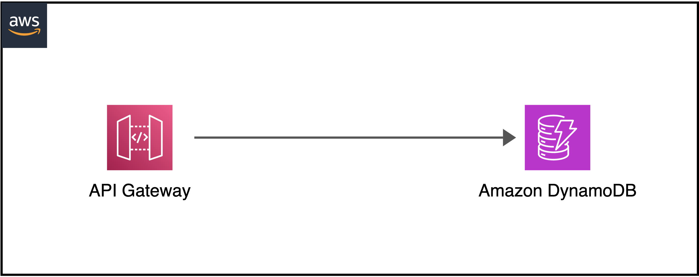

# AWS API Gateway with DynamoDB

:::info AWS Workshop

**Deploy AWS API Gateway to read and update DynamoDB without Lambda.**

:::

How to create an **Amazon API Gateway REST API** that integrates with an **Amazon DynamoDB table** to read and update data?



## Introduction
This topic shows step-by-step how to create the **Amazon API Gateway REST API** that integrates with an **Amazon DynamoDB** table named `resumeTable`. The API integrates directly with the **DynamoDB API** and supports **GetItem** and **PutItem** actions.
All codes created by the **CDK (Python)** to implement the activities such as creating **DynamoDB table**, **API Gateway with DynamoDB integration**, providing all least privilege **IAM roles** and mapping templates for integration request & response.

## Requirements
- [**Python**](https://www.python.org/doc/versions/) version **3.9** or **above**.
- [**Amazon Web Services (AWS) Account**](https://aws.amazon.com/): The **IAM user** must have sufficient permissions to make necessary **AWS service calls** and manage **AWS resources**.
- [**AWS Cloud Development Kit (CDK) in Python**](https://docs.aws.amazon.com/cdk/v2/guide/work-with-cdk-python.html) installed.

## Get started with CDK
Create and go to the working folder, then initialize the **CDK Python project** from **CLI Terminal**.

```bash
mkdir resume-apigw-dynamodb
cd resume-apigw-dynamodb
cdk init app --language python
```
Activate Python **environment**.
```bash
source .venv/bin/activate
```
Install the **required packages**.
```bash
pip install -r requirements.txt
```
## Project structure

If configured properly, the project structure will be shown under the working directory **`\resume-apigw-dynamodb`** as below:

```bash
resume-apigw-dynamodb
├── data
│   └── resume.json
├── integration
│   ├── get_integration_request
│   ├── get_integration_response
│   └── put_integration_request
├── resume_apigw_dynamodb
│   ├── __init__.py
│   └── resume_apigw_dynamodb_stack.py 
├── app.py
├── README.md
└── requirements.txt
```

### Project structure rundown

- `/data/` - Contains **json file** which prodides all information needed to create the **AWS DynamoDB table**.
- `/integration/` - for creating **mapping templates**.
- `/resume_apigw_dynamodb/` - for creating **the deployment stack**.
- `/app.py` - **main project function**.
- `/README.md` - **Introduction and Instructions**.
- `/requirements.txt` - for **required packages' installation**.

## Stack format and codes
:::tip Import necessary packages to deploy.

```py title="resume_apigw_dynamodb_stack.py"
from aws_cdk import (
    Stack,
    CfnOutput,
    aws_dynamodb,
    aws_apigateway,
    aws_iam
)
from constructs import Construct
class ResumeApiGwStack(Stack):
    def __init__(self, scope: Construct, construct_id: str, **kwargs) -> None:
        super().__init__(scope, construct_id, **kwargs)
        # Code start here
```
:::
## Provision DynamoDB table
:::tip AWS DynamoDB
Create the **DynamoDB table** with **partition** `key:id`, `type:string` and provisioned **read/write capacity**:`1`.

```py title="resume_apigw_dynamodb_stack.py"
resume_dynamodb = aws_dynamodb.Table(self, "resumeTable",
   partition_key=aws_dynamodb.Attribute(
      name="id",
      type=aws_dynamodb.AttributeType.STRING),
   billing_mode=aws_dynamodb.BillingMode.PROVISIONED,
   read_capacity=1,
   write_capacity=1
)
```
:::
## Creating API Gateway
:::tip REST API Gateway

```py title="resume_apigw_dynamodb_stack.py"
resume_api = aws_apigateway.RestApi(self, 'resumeApiGW',
    endpoint_types=[aws_apigateway.EndpointType.REGIONAL],
    default_method_options=aws_apigateway.MethodOptions(
        method_responses=[aws_apigateway.MethodResponse(
            status_code="200"
        )]
    )
)
```
:::
## Grant the IAM role for API Gateway to read or write to DynamoDB
:::tip GET/PUT Permission

```py title="resume_apigw_dynamodb_stack.py"
rgetputitem_apigw_policy = aws_iam.Policy(self, "GetPutItemApiGWPolicy",
    statements=[aws_iam.PolicyStatement(
        actions=["dynamodb:GetItem", "dynamodb:PutItem"],
        effect=aws_iam.Effect.ALLOW,
        resources=[resume_dynamodb.table_arn]
    )]
)
getputitem_apigw_role = aws_iam.Role(self, "GetPutItemApiGWRole",
    assumed_by=aws_iam.ServicePrincipal("apigateway.amazonaws.com")
)
getputitem_apigw_role.attach_inline_policy(getputitem_apigw_policy)
```
:::
## JSON file format
:::tip RESUME DATA

```json title="resume.json"
{
    "id": <ID>,
    "name": <NAME>,
    "title": <TITLE>,
    "email": <EMAIL>,
    "location": <LOCATION>,
    "profiles": [
      {
        "network": <NETWORK>,
        "username": <USERNAME>,
        "url": <LINK>
      }
    ],
    "skills": [
      {
        "title": <SKILL NAME>,
        "score": <SCORE>,
        "rating": <LEVEL>
      }
    ],
    "languages": [
      {
        "language": <LANGUAGE>,
        "score": <SCORE>,
        "rating": <RATING>
      }
    ],
    "summary": [
      {
        "para": <DESCRIPTION>
      }
    ],
    "experience": {
      "current": {
        "role": <CAREER ROLE>,
        "from": <FROM>,
        "description": [
          {
            "li": <DESCRIPTION>
          }
        ]
      },
      "past": [
        {
          "role": <CAREER ROLE>,
          "duration": <FROM TO>,
          "description": [
            {
              "li": <DESCRIPTION>
            }
          ]
        }
      ]
    },
    "certificates": [
      {
        "title": <CERT NAME>,
        "valid": <VALIDITY>,
        "link": <LINK>,
        "description": <DESCRIPTION>
      }
    ],
    "education": [
      {
        "title": <CERT NAME>,
        "valid": <VALIDITY>,
        "description": <DESCRIPTION>
      }
    ]
  }
```
:::
## Mapping templates for integration
Save all 03 below files in folder **`integration`**.
### GET method integration request
:::tip VTL
Apache’s Velocity Templating Language (VTL)

```vtl title="get_integration_request"
{
    "TableName": "$input.params('tablename')",
    "Key": {
        "id": {"S": "$input.params('id')"}
    }
}
```
:::
### GET method integration response
:::tip VTL
Apache’s Velocity Templating Language (VTL)

```vtl title="get_integration_response"
#set($inputRoot = $input.path('$'))
{
  "id": "$inputRoot.Item.id.S",
  "name": "$inputRoot.Item.name.S",
  "title": "$inputRoot.Item.title.S",
  "email": "$inputRoot.Item.email.S",
  "location": "$inputRoot.Item.location.S",
  "profiles": [
    #foreach($elem in $inputRoot.Item.profiles.L)
    {
        "network": "$elem.M.network.S",
        "username": "$elem.M.username.S",
        "url": "$elem.M.url.S"
    }#if($foreach.hasNext),#end
    #end
  ],
  "skills": [
    #foreach($elem in $inputRoot.Item.skills.L)
    {
        "title": "$elem.M.title.S",
        "score": "$elem.M.score.S",
        "rating": "$elem.M.rating.S"
    }#if($foreach.hasNext),#end
    #end
  ],
  "languages": [
    #foreach($elem in $inputRoot.Item.languages.L)
    {
        "language": "$elem.M.language.S",
        "score": "$elem.M.score.S",
        "rating": "$elem.M.rating.S"
    }#if($foreach.hasNext),#end
    #end
  ],
  "summary": [
    #foreach($elem in $inputRoot.Item.summary.L)
    {
        #foreach($key in $elem.M.keySet())
            #set($value = $elem.M.get($key).S)
            "$key": "$value"#if($foreach.hasNext),#end
        #end
    }
    #if($foreach.hasNext),#end
    #end
  ],
  "experience": {
    "current": {
        "role": "$inputRoot.Item.experience.M.current.M.role.S",
        "from": "$inputRoot.Item.experience.M.current.M.from.S",
        "description": [
            #foreach($elem in $inputRoot.Item.experience.M.current.M.description.L)
            {
                "li": "$elem.M.li.S"
            }#if($foreach.hasNext),#end
            #end
        ]
    },
    "past": [
        #foreach($elem in $inputRoot.Item.experience.M.past.L)
        {
            "role": "$elem.M.role.S",
            "duration": "$elem.M.duration.S",
            "description": [
                #foreach($item in $elem.M.description.L)
                {
                    "li": "$item.M.li.S"
                }#if($foreach.hasNext),#end
                #end
            ]
        }#if($foreach.hasNext),#end
        #end
    ]
  },
  "certificates": [
    #foreach($elem in $inputRoot.Item.certificates.L)
    {
        "title": "$elem.M.title.S",
        "valid": "$elem.M.valid.S",
        "link": "$elem.M.link.S",
        "description": "$elem.M.description.S"
    }#if($foreach.hasNext),#end
    #end
  ],
  "education": [
    #foreach($elem in $inputRoot.Item.education.L)
    {
        "title": "$elem.M.title.S",
        "valid": "$elem.M.valid.S",
        "description": "$elem.M.description.S"
    }#if($foreach.hasNext),#end
    #end
  ]
}
```
:::
### POST method integration request
:::tip VTL
Apache’s Velocity Templating Language (VTL)

```vtl title="put_integration_request"
{
    "TableName": "$input.params('tablename')",
    "Item": {
        "id": {"S": "$input.path('$.id')"},
        "name": {"S": "$input.path('$.name')"},
        "title": {"S": "$input.path('$.title')"},
        "email": {"S": "$input.path('$.email')"},
        "location": {"S": "$input.path('$.location')"},
        "profiles": {"L": [
            #foreach($elem in $input.path('$.profiles'))
            {"M": {
                #foreach($key in $elem.keySet())
                    #set($value = $elem.get($key))
                    "$key": { "S": "$value" }#if($foreach.hasNext()),#end
                #end
            }
            }#if($foreach.hasNext()),#end
            #end
            ]
        },
        "skills": {"L": [
            #foreach($elem in $input.path('$.skills'))
            {"M": {
                #foreach($key in $elem.keySet())
                    #set($value = $elem.get($key))
                    "$key": { "S": "$value" }#if($foreach.hasNext()),#end
                #end
            }
            }#if($foreach.hasNext()),#end
            #end
            ]
        },
        "languages": {"L": [
            #foreach($elem in $input.path('$.languages'))
            {"M": {
                #foreach($key in $elem.keySet())
                    #set($value = $elem.get($key))
                    "$key": { "S": "$value" }#if($foreach.hasNext()),#end
                #end
            }
            }#if($foreach.hasNext()),#end
            #end
            ]
        },
        "summary":{
            "L": [
                #foreach($elem in $input.path('$.summary'))
                {
                    "M": {
                        #foreach($key in $elem.keySet())
                            #set($value = $elem.get($key))
                            "$key": { "S": "$value" }#if($foreach.hasNext()),#end
                        #end
                    }
                }#if($foreach.hasNext()),#end
                #end
            ]
        },
        "experience": {
            "M": {
                "current": {
                    "M": {
                        "role": {"S": "$input.path('$.experience.current.role')"},
                        "from": {"S": "$input.path('$.experience.current.from')"},
                        "description": {
                            "L": [
                                #foreach($elem in $input.path('$.experience.current.description'))
                                {
                                    "M": {
                                        #foreach($key in $elem.keySet())
                                        #set($value = $elem.get($key))
                                        "$key": { "S": "$value" }#if($foreach.hasNext()),#end
                                        #end
                                    }
                                }#if($foreach.hasNext()),#end
                                #end
                            ]
                        }
                    }
                },
                "past": {
                    "L": [
                        #foreach($elem in $input.path('$.experience.past'))
                        {
                            "M": {
                                "role": {"S": "$elem.role"},
                                "duration": {"S": "$elem.duration"},
                                "description": {
                                    "L": [
                                        #foreach($description in $elem.description)
                                        {
                                            "M": {
                                                #foreach($key in $description.keySet())
                                                #set($value = $description.get($key))
                                                "$key": { "S": "$value" }#if($foreach.hasNext()),#end
                                                #end
                                            }
                                        }#if($foreach.hasNext()),#end
                                        #end
                                    ]
                                }
                            }
                        }
                        #if($foreach.hasNext()),#end
                        #end
                    ]
                }
            }
        },
        "certificates": {
            "L": [
                #foreach($elem in $input.path('$.certificates'))
                {
                    "M": {
                        #foreach($key in $elem.keySet())
                            #set($value = $elem.get($key))
                            "$key": { "S": "$value" }#if($foreach.hasNext()),#end
                        #end
                    }
                }
                #if($foreach.hasNext()),#end
                #end
            ]
        },
        "education": {
            "L": [
                #foreach($elem in $input.path('$.education'))
                {
                    "M": {
                        #foreach($key in $elem.keySet())
                            #set($value = $elem.get($key))
                            "$key": { "S": "$value" }#if($foreach.hasNext()),#end
                        #end
                    }
                }
                #if($foreach.hasNext()),#end
                #end
            ]
        }
    }
}
```
:::
## Create variables to read mapping templates
:::tip INTEGRATION FILE READ

```py title="resume_apigw_dynamodb_stack.py"
# Read mapping template
get_integration_request = open("./integration/get_integration_request", "r")
get_integration_request_read = get_integration_request.read()
get_integration_request.close()

get_integration_response = open("./integration/get_integration_response", "r")
get_integration_response_read = get_integration_response.read()
get_integration_response.close()

put_integration_request = open("./integration/put_integration_request", "r")
put_integration_request_read = put_integration_request.read()
put_integration_request.close()
```
:::
## API Gateway with DynamoDB integrated
### GetItem action, CORS enabled, mapping templates for integration request & response
:::tip INTEGRATION CONFIGURATION
```py title="resume_apigw_dynamodb_stack.py"
getitem_aws_integration = aws_apigateway.AwsIntegration(
    service="dynamodb",
    action="GetItem",
    options=aws_apigateway.IntegrationOptions(
        credentials_role=getputitem_apigw_role,
        passthrough_behavior=aws_apigateway.PassthroughBehavior.WHEN_NO_TEMPLATES,
        request_templates={"application/json": get_integration_request_read},
        integration_responses=[aws_apigateway.IntegrationResponse(
            status_code="200",
            response_parameters={"method.response.header.Access-Control-Allow-Origin": "'*'"},
            response_templates={"application/json": get_integration_response_read}
        )]
    )
)
```
:::
### PutItem action, CORS enabled, mapping templates for integration request
:::tip INTEGRATION CONFIGURATION
```py title="resume_apigw_dynamodb_stack.py"
putitem_aws_integration = aws_apigateway.AwsIntegration(
    service="dynamodb",
    action="PutItem",
    options=aws_apigateway.IntegrationOptions(
        credentials_role=getputitem_apigw_role,
        passthrough_behavior=aws_apigateway.PassthroughBehavior.WHEN_NO_TEMPLATES,
        request_templates={"application/json": put_integration_request_read},
        integration_responses=[aws_apigateway.IntegrationResponse(
            status_code="200",
            response_parameters={"method.response.header.Access-Control-Allow-Origin": "'*'"})]
    )
)
```
:::
### Configure and add GET method
:::tip  Get method added
```py title="resume_apigw_dynamodb_stack.py"
get_method_response = [aws_apigateway.MethodResponse(
    status_code="200",
    response_parameters={"method.response.header.Access-Control-Allow-Origin": True}
)]
resume_api.root.add_method("GET",
    integration=getitem_aws_integration,
    method_responses=get_method_response
)
```
:::
### Configure and add POST method
:::tip  Post method added
```py title="resume_apigw_dynamodb_stack.py"
post_method_response = [aws_apigateway.MethodResponse(
    status_code="200",
    response_parameters={"method.response.header.Access-Control-Allow-Origin": True}
)]
resume_api.root.add_method("POST",
    integration=putitem_aws_integration,
    method_responses=post_method_response
)
```
:::
## Output value for DynamoDB table and API Gateway production {#output-value}
**Output value** required to perform the **API Gateway** execution.
```bash
CfnOutput(self, "TableName", value=resume_dynamodb.table_name)
CfnOutput(self, "APIUrl", value=resume_api.url)
```
## Test and deploy application
```bash
# Test and create CloudFormation template
cdk synth

# Deploy appliction
cdk deploy
```
## Evaluation
After deploying successfully, you can use [output value](#output-value) to test both read and write to the **DynamoDB table** and manually adjust the input or output as per your needs. The **URL** looks like as below:
```bash
# Read DynamoDB table url
url = $(APIUrl.value?tablename=TableName.value&id=<YOUR ID>)

# Write DynamoDB table url
url = $(APIUrl.value?tablename=TableName.value)
```
## Cleanup
```bash
cdk destroy
```
You should **manually delete DynamoDB table** after Stack deleted.

**Thanks for your reading!**