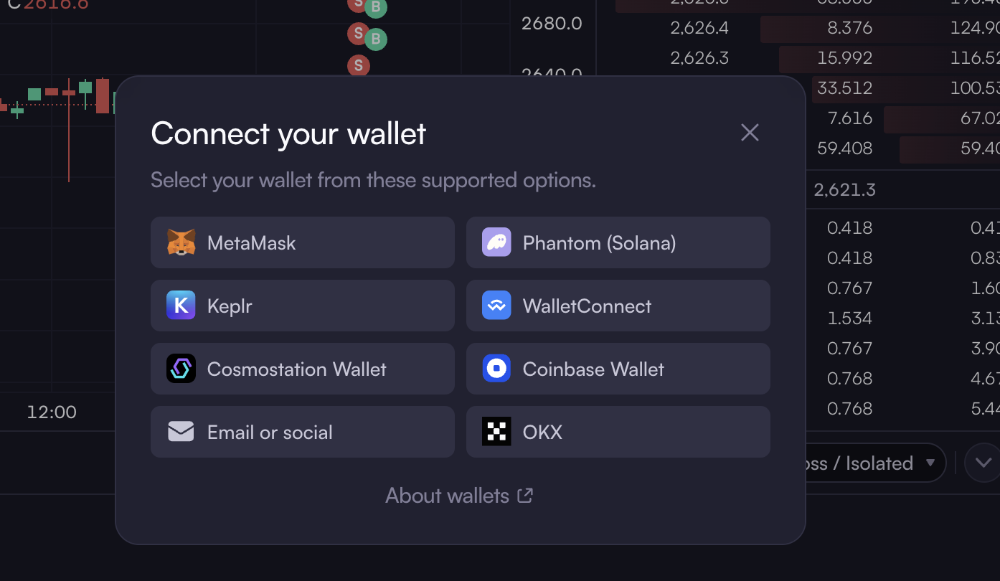
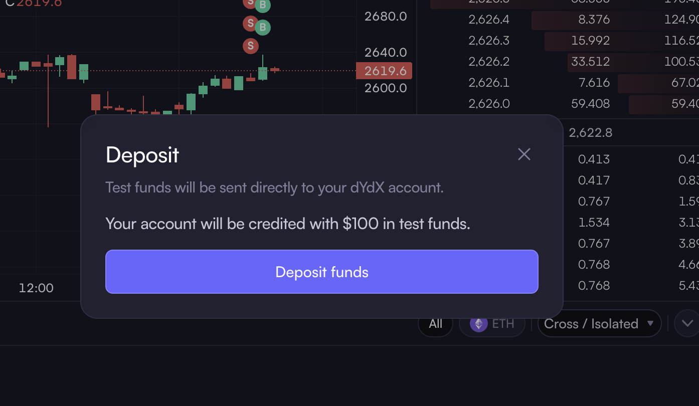
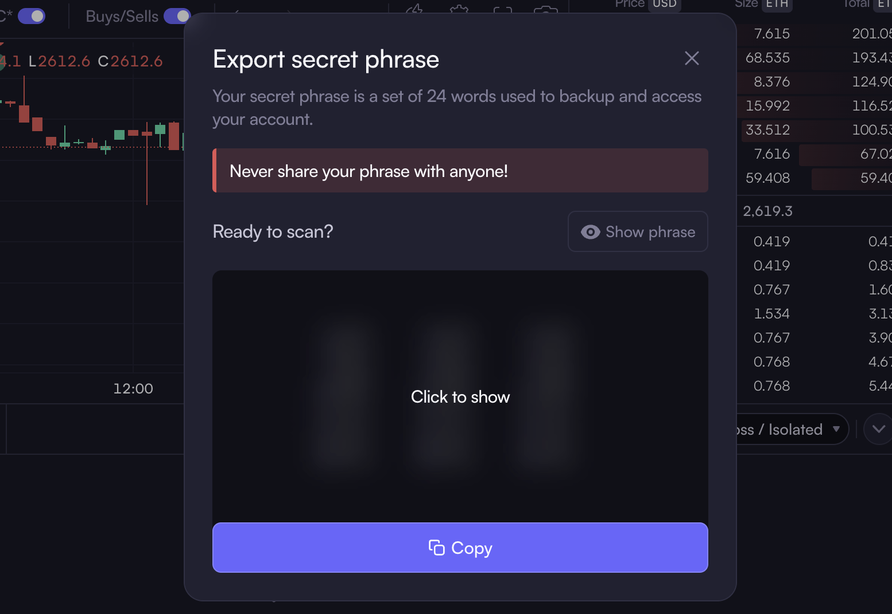
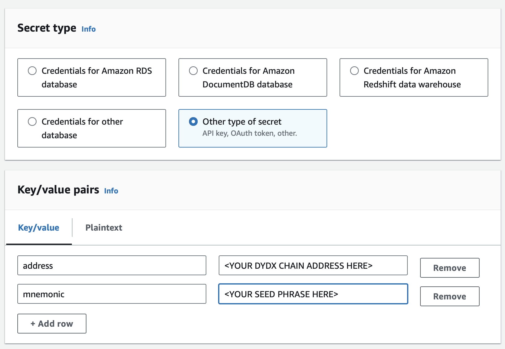
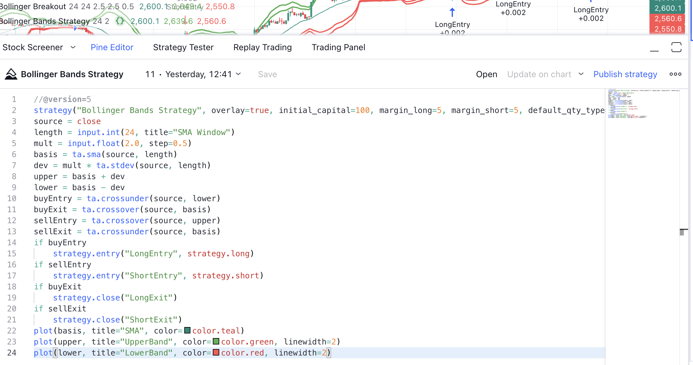
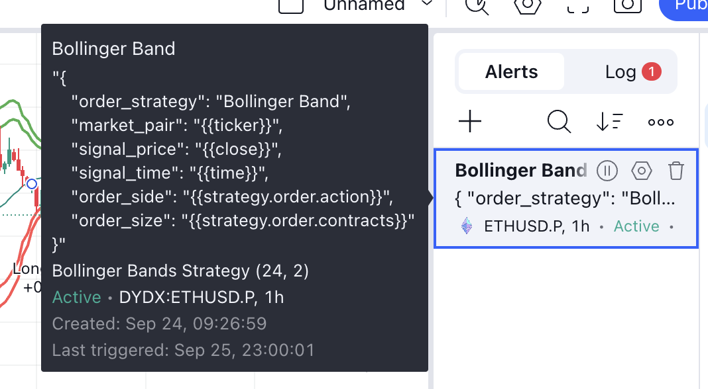
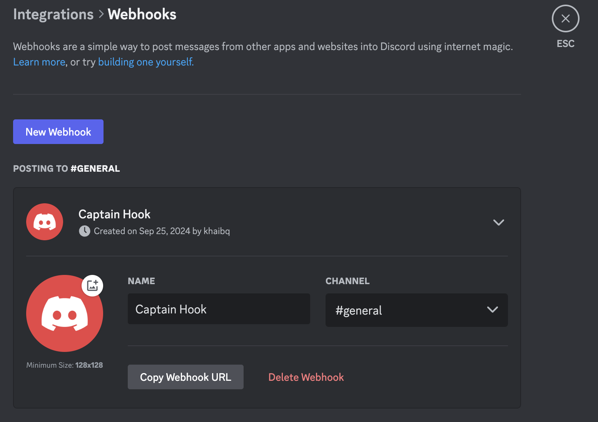
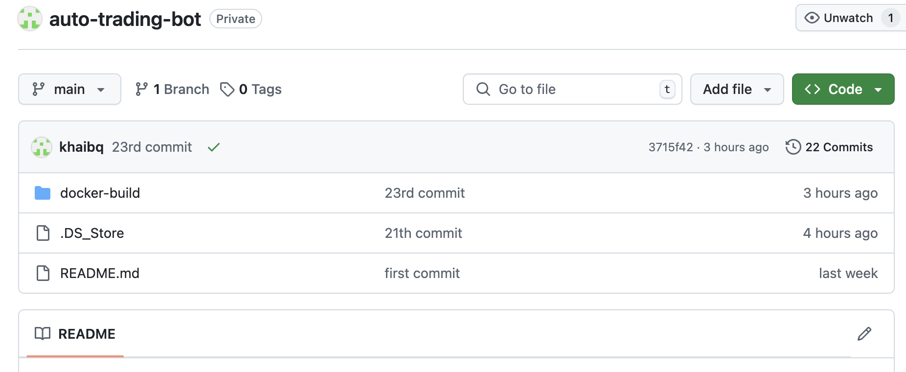

# Build related services for AWS
## Create a trading account on the exchange platform
- Go to [dYdX Testnet](https://v4.testnet.dydx.exchange/trade/ETH-USD) webpage, then press **`Connect wallet`** at the top right corner to connect your wallet.



- Follow the the instructions until the account available to trade. You will get **$100** test fund in account by pressing **`Deposit funds`**.



- Copy and save the **dYdX Chain Address** for later use in the application.
- Go to **`Export seed phrase`** to get your **secret (mnemonic) phrase** of your chain address. You must copy and save this phrase in a safe place in order to sign with a trade.



## Create your secret wallet info in AWS Secret Manager
Open [**AWS Secret Manager**](https://aws.amazon.com/secrets-manager/) in the **management console**. Follow the instructions to create a new secret named **`dydx_secret`** or your own name with the **`address`** and **`mnemonic`** stored from above.



## Prepare the Pine Scrip strategy {#webhook}
- Follow the instructions to create an account on [TradingView](https://www.tradingview.com/?aff_id=143029). Find the console for **ETHUSD.P** market on **DYDX exchange data**. Set the resolution as `1H` (1 hour).
- **Strategy**: I picked a simple **Bollinger Band strategy** which places the `LONG` position when close price cross under lower band and `EXIT` position when close price cross over the base line (SMA). In reverse, `SHORT` position when close price cross over upper band and `EXIT` position when close price cross under the base line (SMA).



:::warning Dislaimer
Please take note that this strategy is for demo purpose only and that is not a financial advice.
:::
- Setup the **alert** as below:



## Setup Discord webhook to post the message notification
- Follow the instructions on [Discord](https://discord.com/) to create an account and set up your server. From server setting, choose **`Server Settings`** —>  **`Integrations`** then press **`New Webhook`**.



- Press **`Copy Webhook URL`** to get webhook link. The webhook link format looks like below:
    ```
    https://discord.com/api/webhooks/{webhook_id}/{webhook_token}
    ```
You need to record both **`webhook_id`** and **`webhook_token`** for later use in the application.

## Create the GitHub Repo
- Create a new or use your existing [GitHub](https://github.com/) account with a repo named **`auto-trading-bot`** or named it as your own and set branch is **`main`**.
- Record your GitHub **`owner name`**, **`repo name`** and **`branch`** for the application.

