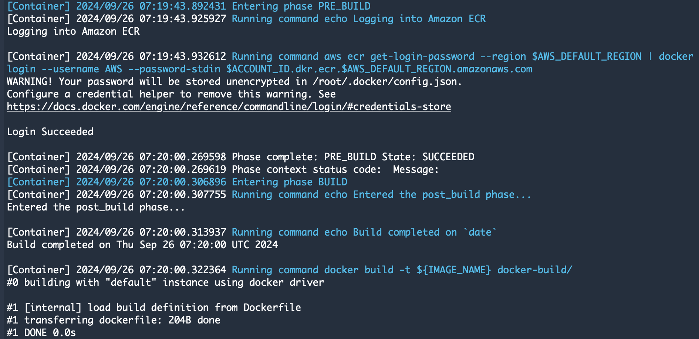

# Deploy, Test and Cleanup
## Deployment
- **CDK deployment from CLI Terminal.**
```bash
# CDK template output
cdk synth --all

# Deploy all stacks - Need to wait a couple minutes to let 1st stack complete with docker image deployed.
cdk deploy --all
```
- Record the **REST API `URL output`** to test in the [**previous step**](./stack-2-creation#rest-api-gateway).


- Fill the above **REST API URL** to **TradingView webhook** together with the **alert** prepared in [**Build related services for AWS**](./configurations#webhook).


## Testing
### Post REST API URL
```bash
curl -X POST https://<YOUR_API_ID>.execute-api.<REGION_NAME>.amazonaws.com/prod/webhook \
  -H 'content-type: application/json' \
  -d '{"order_strategy": "Bollinger", "signal_time": "2024-09-26", "signal_price": "2600", "market_pair": "ETHUSD.P", "order_side": "buy", "order_size": "0.001"}'
```
- **And the result shown below:**

    

- **From the exchange platform:**

    

- **From [**Mintscan**](https://www.mintscan.io/) dYdX chain explorer:**
    - **Transaction detail**
    
    
    
    - **Transaction message**
    
    

- **From [Discord](https://discord.com/) message:**

    

### GitHub commit and CodeBuild
Whenever you update code and commit on **GitHub**, **CodeBuild** will process automatically and build logs look like below:




## Cleanup
- Manually delete **objects in project bucket**.
- Manually delete **all images in ECR**.
- CDK cleanup **all stacks** by **CLI** as below:
```bash
cdk destroy --all
```