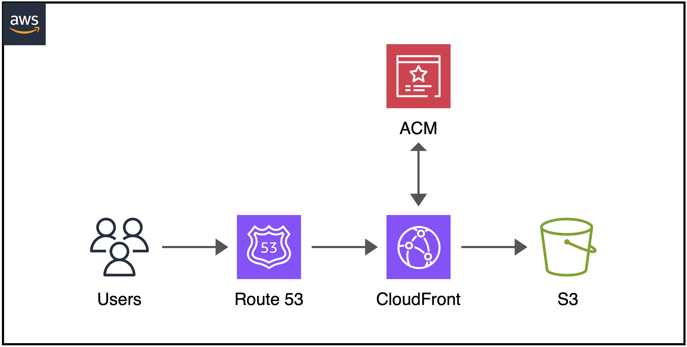
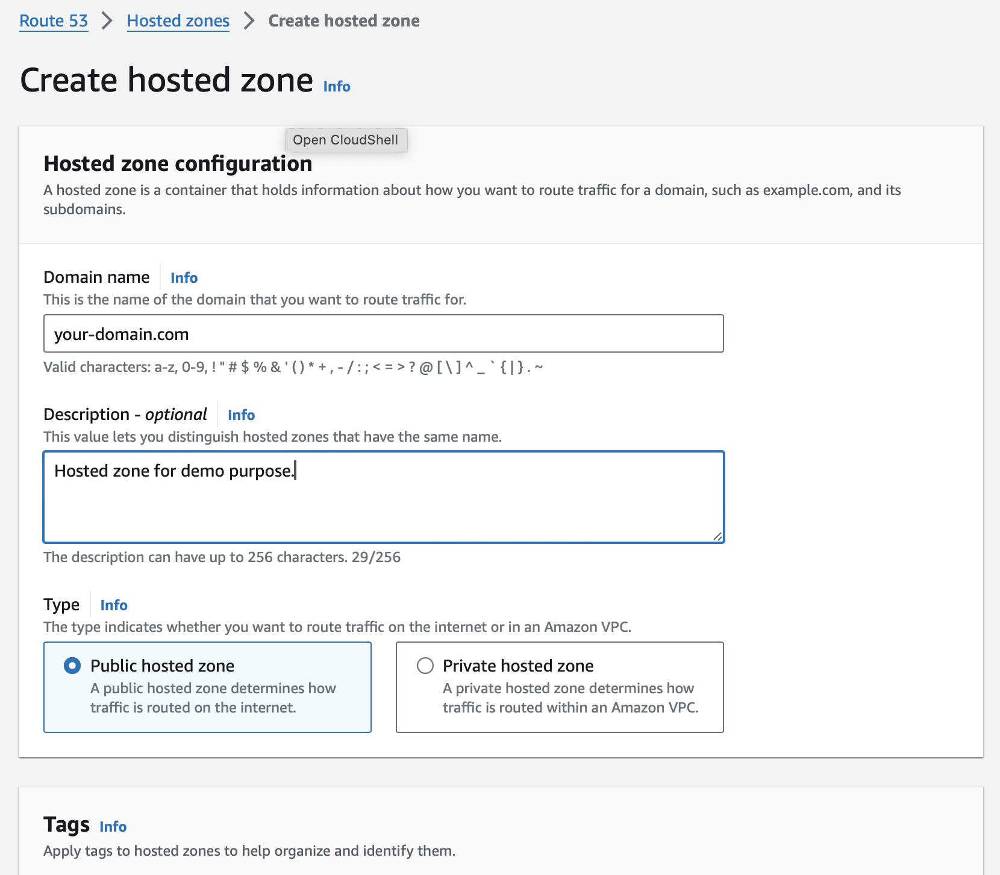
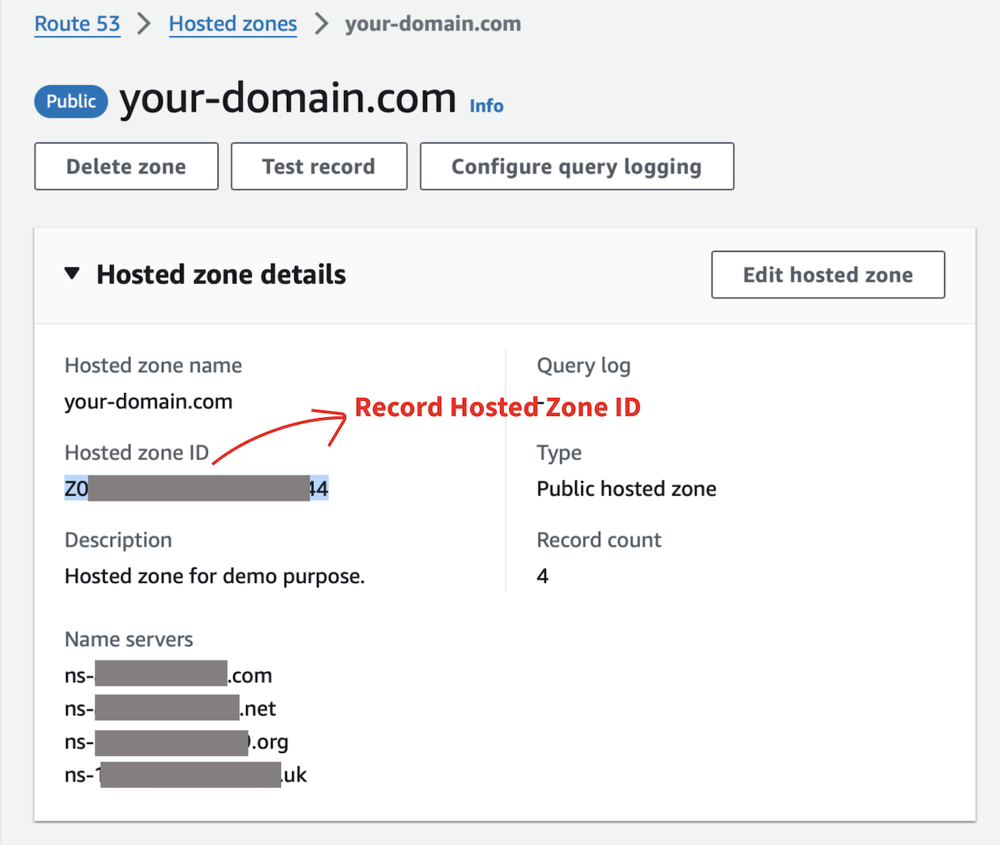
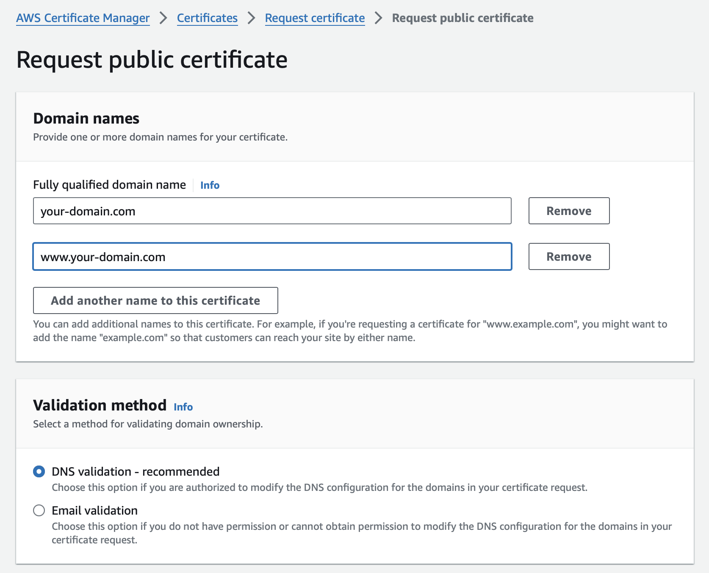
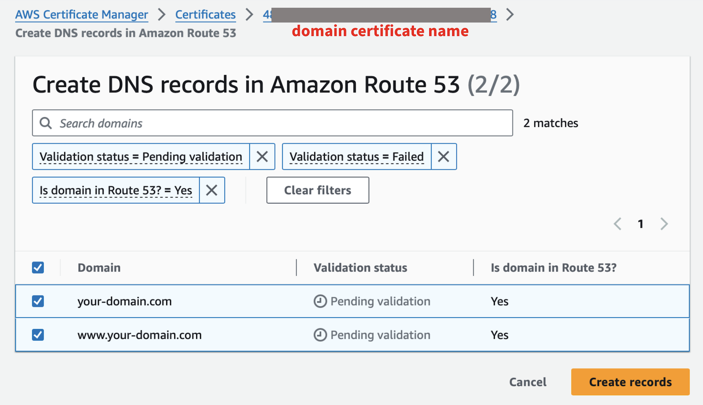
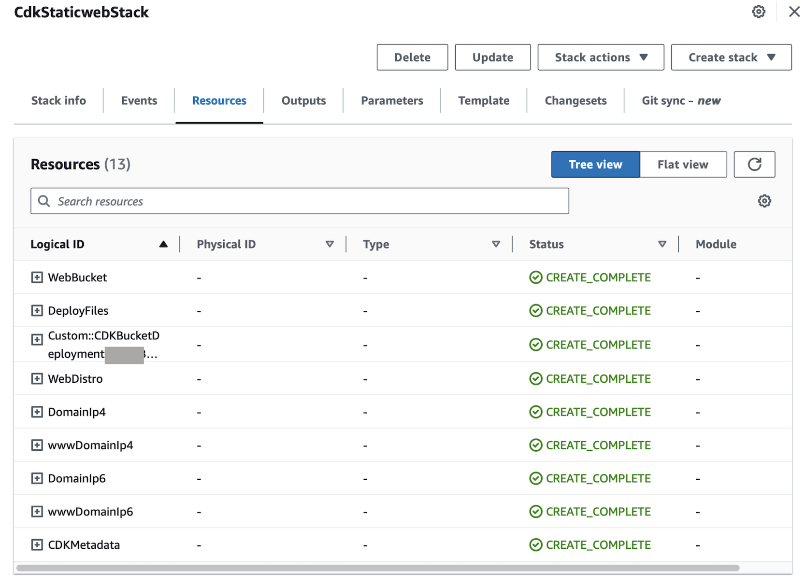
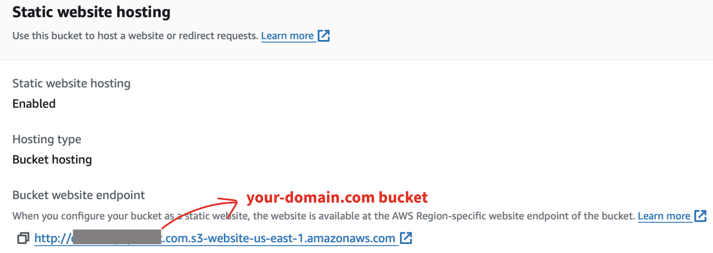
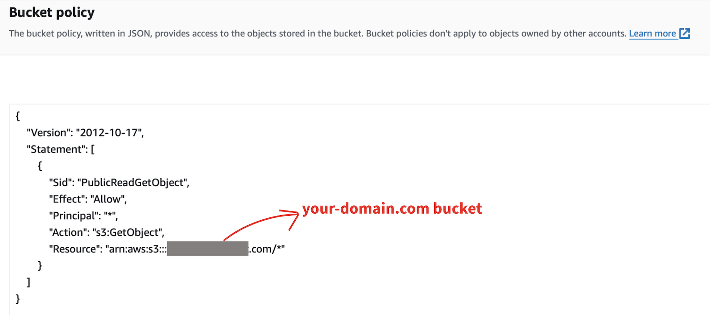
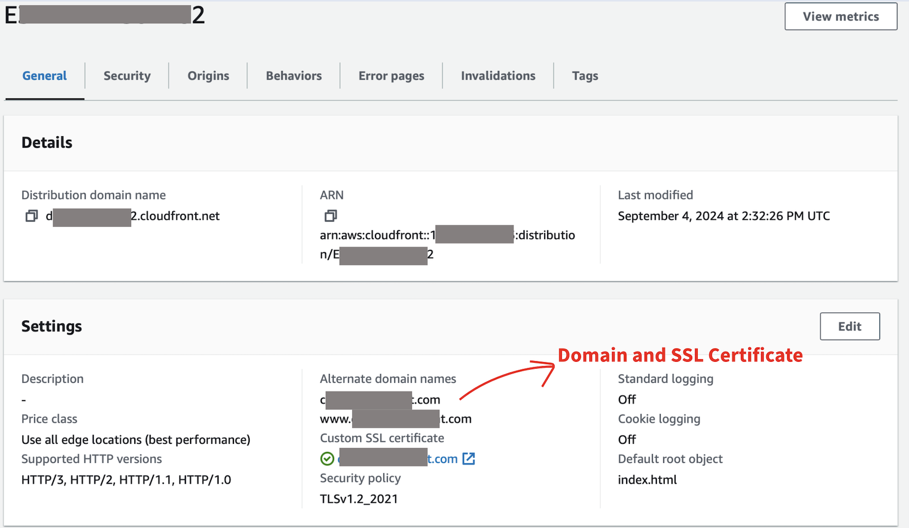
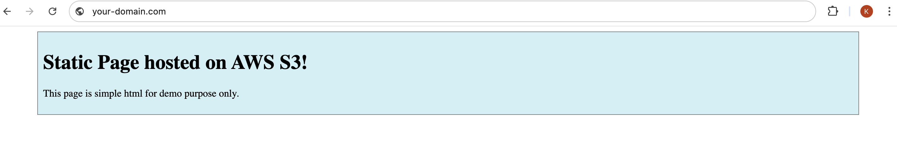

# AWS S3 Static page
:::info AWS Workshop

**Build a static page with Route 53, CloudFront and S3 by CDK Python.**

:::
Nowadays, the static pages become more popular due to advances in frontend technologies like **CSS** and **Javascript**, which give users a richer and more interactive experience.

This pattern shows step-by-step how to build a static page by combination of **Amazon Web Services Route 53 Hosted Zone, CloudFront Distribution and S3 Storage**.


## Introduction
All codes written in the **CDK (Python)** to automatically create a stack including domain name **S3 bucket** for static website hosting, a **CloudFront distribution** integrated with **Route 53** hosted zone and **ACM certificate** issued by **Amazon Web Services**. Providing the least privilege **IAM role** for **S3** to enable **static website hosting**.
## Requirements
- **A domain name** registered from **AWS** or **other DNS providers**.
- [**Python**](https://www.python.org/doc/versions/) version **3.9** or **above**.
- [**Amazon Web Services (AWS) Account**](https://aws.amazon.com/): The **IAM user** must have sufficient permissions to make necessary **AWS service calls** and manage **AWS resources**.
- [**AWS Cloud Development Kit (CDK) in Python**](https://docs.aws.amazon.com/cdk/v2/guide/work-with-cdk-python.html) installed.
## Get started with CDK
Create and go to the working folder, then initialize the **CDK Python project** from **CLI Terminal**.
```bash
mkdir cdk-staticweb
cd cdk-staticweb
cdk init app --language python
```
Activate Python **environment**.
```bash
source .venv/bin/activate
```
Install the **required packages**.
```bash
pip install -r requirements.txt
```
## Project structure

If configured properly, the project structure will be shown under the working directory **`\cdk-staticweb`** as below:

```bash
cdk-staticweb
├── static-page
│   ├── index.html
│   └── styles.css
├── cdk-staticweb
│   ├── __init__.py
│   └── cdk-staticweb_stack.py 
├── app.py
├── README.md
└── requirements.txt
```

### Project structure rundown

- `/static-page/` - Contains **index.html** for **static web hosting**.
- `/cdk-staticweb/` - for creating **the deployment stack**.
- `/app.py` - **main project function**.
- `/README.md` - **Introduction and Instructions**.
- `/requirements.txt` - for **required packages' installation**.
## Working with AWS Management Console
Now we get started with **AWS Management Console** to create a **hosted zone** and validate the **ACM public certificate** issued by **Amazon Web Services** as a preparation step for **CDK application deployment**.
### Route 53 hosted zone
#### 1. Create a hosted zone
Create a **hosted zone** with your **domain name** in **Route 53**.



Then press **`Create hosted zone`** to create a hosted zone under your domain name.

After your hosted zone created, you will find name servers in **`Hosted zone details`**. Follow these steps to configure your **DNS**:
- Record all 04 **`Name servers`** listed below.
- Go to your domain registrar to create a **new DNS record** with **`NS`** type for your domain then update the name servers to use with **Route 53**.



#### 2. Request public certificate from ACM (AWS Certificate Manager)


In the scenario, you may request both **`your-domain.com`** and **`www.your-domain.com`** and **DNS validation method** as recommended. Then press **`Request`**.

#### 3. DNS validation
- Press **`Create records`** for DNS validation.
- If the validation is successful, record the **`Certificates`** name for later use in CDK deployment.



### Static page preparation
Create a **folder** for static content.
```bash
mkdir static-page
```
For simple case, you can create a **index.html** file and save in folder **`static-page`** as below:
:::tip Static page

```html title="./static-page/index.html"
<!DOCTYPE html>
<html>
<head>
<style>
.center_div {
  border: 1px solid gray;
  margin-left: auto;
  margin-right: auto;
  width: 90%;
  background-color: #d0f0f6;
  text-align: left;
  padding: 8px;
}
</style>
</head>
<body>

<div class="center_div">
  <h1>Static Page hosted on AWS S3!</h1>
  <p>This page is simple html for demo purpose only.</p>
</div>

</body>
</html>
```
:::

From my **GitHub repo**, I took the **index.html** built with **CSS** and **Javascript** to create a resume page deployed from **Amazon API Gateway REST API** as instructed in [**AWS API Gateway with DynamoDB**](./apigateway-dynamodb.mdx).

## Create CDK Stack
:::tip Main function

```py title="./app.py"
#!/usr/bin/env python3
import aws_cdk as cdk
from cdk_staticweb.cdk_staticweb_stack import CdkStaticwebStack

app = cdk.App()
CdkStaticwebStack(app, "CdkStaticwebStack", synthesizer=cdk.DefaultStackSynthesizer(generate_bootstrap_version_rule=False))
app.synth()
```
:::
:::tip Import necessary packages to deploy

```py title="./cdk-staticweb/cdk-staticweb_stack.py"
from aws_cdk import (
    Stack,
    Aws,
    aws_route53,
    aws_route53_targets,
    aws_s3,
    aws_s3_deployment,
    aws_iam,
    aws_cloudfront,
    aws_cloudfront_origins,
    aws_certificatemanager
)
from constructs import Construct

class CdkStaticwebStack(Stack):

    def __init__(self, scope: Construct, construct_id: str, **kwargs) -> None:
        super().__init__(scope, construct_id, **kwargs)
        # Your code start here
```
:::
:::tip Declare your hosted zone and certificate

```py title="./cdk-staticweb/cdk-staticweb_stack.py"
domain_name = "your-domain.com"
hosted_zone_id = <YOUR HOSTED ZONE ID FROM STEP 1>
domain_cert_name = <YOUR CERTIFICATE NAME FROM STEP 1>

hosted_zone = aws_route53.HostedZone.from_hosted_zone_attributes(self, "WebHostedZone",
    zone_name=domain_name,
    hosted_zone_id=hosted_zone_id)

arn_cert = f"arn:aws:acm:{Aws.REGION}:{Aws.ACCOUNT_ID}:certificate/{domain_cert_name}"
domain_cert = aws_certificatemanager.Certificate.from_certificate_arn(self, "DomainCert",
    certificate_arn=arn_cert)
```
:::
:::tip Create and configure S3 bucket as static website hosting

```py title="./cdk-staticweb/cdk-staticweb_stack.py"
web_bucket = aws_s3.Bucket(self, "WebBucket",
    bucket_name=domain_name,
    block_public_access=aws_s3.BlockPublicAccess(block_public_policy=False),
    website_index_document="index.html"
)
```
:::
:::tip Add bucket policy

```py title="./cdk-staticweb/cdk-staticweb_stack.py"
policy_statement = {
    "Sid": "PublicReadGetObject",
    "Effect": "Allow",
    "Principal": "*",
    "Action": ["s3:GetObject"],
    "Resource": [f"{web_bucket.bucket_arn}/*"]
}
web_bucket.add_to_resource_policy(aws_iam.PolicyStatement.from_json(policy_statement))
```
:::
:::tip Deploy static content into S3 bucket
**CDK** will write all files in **`static-page`** folder to **S3 bucket**.

```py title="./cdk-staticweb/cdk-staticweb_stack.py"
aws_s3_deployment.BucketDeployment(self, "DeployFiles",
    sources=[aws_s3_deployment.Source.asset("./static-page")],
    destination_bucket=web_bucket)
```
:::
:::tip Create CloudFront Distribution
Apply both domain names as **`your-domain.com`** & **`www.your-domain.com`** with same certificate.

```py title="./cdk-staticweb/cdk-staticweb_stack.py"
web_distribution = aws_cloudfront.Distribution(self, "WebDistro",
    enable_ipv6=True,
    default_root_object="index.html",
    domain_names=[domain_name, f"www.{domain_name}"],
    certificate=domain_cert,
    http_version=aws_cloudfront.HttpVersion.HTTP2_AND_3,
    default_behavior=aws_cloudfront.BehaviorOptions(
        origin=aws_cloudfront_origins.S3Origin(web_bucket)
    )
)
```
:::
:::tip Route traffic to CloudFront
Create alias records to route traffic both **ip4** & **ip6** to **CloudFront distribution** for both domain names.

```py title="./cdk-staticweb/cdk-staticweb_stack.py"
aws_route53.ARecord(self, "DomainIp4",
    zone=hosted_zone,
    target=aws_route53.RecordTarget.from_alias(
        alias_target=aws_route53_targets.CloudFrontTarget(web_distribution)))

aws_route53.ARecord(self, "wwwDomainIp4",
    record_name="www",
    zone=hosted_zone,
    target=aws_route53.RecordTarget.from_alias(
        alias_target=aws_route53_targets.CloudFrontTarget(web_distribution)))

aws_route53.AaaaRecord(self, "DomainIp6",
    zone=hosted_zone,
    target=aws_route53.RecordTarget.from_alias(
        alias_target=aws_route53_targets.CloudFrontTarget(web_distribution)))

aws_route53.AaaaRecord(self, "wwwDomainIp6",
    record_name="www",
    zone=hosted_zone,
    target=aws_route53.RecordTarget.from_alias(
        alias_target=aws_route53_targets.CloudFrontTarget(web_distribution)))
```
:::
## CDK Deployment
```bash
# Test and create CloudFormation template
cdk synth

# Deploy appliction
cdk deploy
```
## Checking and Testing
After deployment successfully, you will find results as below:

### CloudFormation CDK Stack



### Bucket configuration for static website hosting



### Bucket policy



### CloudFront Distribution



### Test your domain name



## Cleanup
- Delete **CDK stack**.
```bash
cdk destroy
```
- Manually delete **`your-domain.com`** bucket.
- Manually delete **hosted zone** and **domain certificate**.

**Thanks a lot for your reading!**