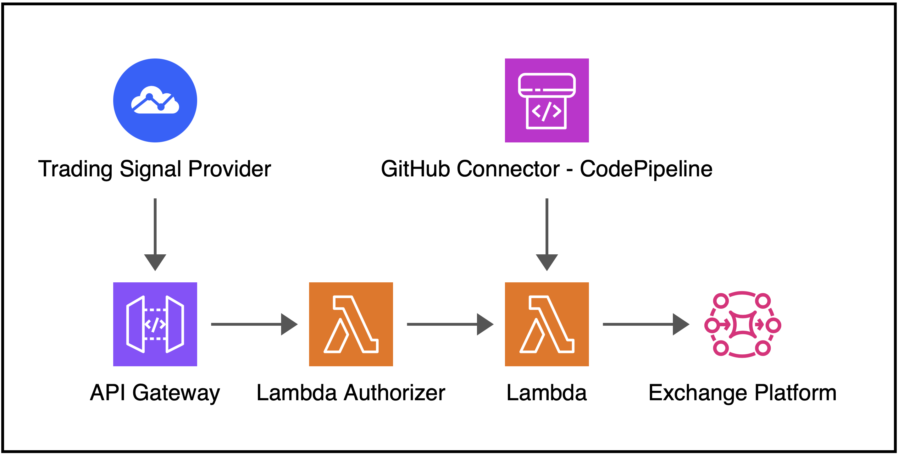

# Get started
import TOCInline from '@theme/TOCInline';

:::info Auto Trading Bot
**Crypto trading bot** integrated with **Amazon Web Services**, **Trading Signal Provider** and **Exchange Platform**.
:::

## Introduction
**Crypto trading** is always my passion then today I would like to create a **basic workflow** of the **auto trading bot** which receiving **webhook consumer** and processed by **AWS API Gateway** and **Lambda**, then placing the order on an **exchange platform** together with sending the **message notification** through your **smart phone**.



The **Auto Trading Bot** requires some **side services** in order to integrate with **AWS** as below:

<TOCInline toc={toc} minHeadingLevel={3} maxHeadingLevel={3} />

### Trading Signal Provider {#trading-signal-provider} 
I would like to pick the simple **Bollinger Band strategy** written in **Pine Script** and applied in [TradingView](https://www.tradingview.com/?aff_id=143029) to receive trading signals through a webhook provider.

### AWS API Gateway {#api-gateway}
**REST API Gateway** created to process the signal from the **webhook** integrated with **Lambda main function** and authorized by **Lambda Authorizer**.
- **Lambda Authorizer**: Authorizing only allowed the white IP list sent from trading signal provider.
- **Lambda Main Function**: Process the trading signal such as **BUY** or **SELL** and size, then automatically place the order on the exchange platform. In this case, I am going to pick [dYdX](https://dydx.trade/) decentralized trading platform since I got familiar with for a while. Practically, you can select whatever exchange platforms which provide the Trading APIs.

### AWS Lambda Main Function {#lambda-main-function}
Written in **Python 3.12**. The function includes codes to implement the followings:
- Connect to the exchange platform, check the sufficient collateral and place an order.
- Send the message notification through [Discord](https://discord.com/) to your smart devices.

## Requirements
- [**Python**](https://www.python.org/doc/versions/) version **3.9** or **above**.
- [**GibHub**](https://github.com/) account for CI/CD deployment.
- [**Amazon Web Services (AWS) Account**](https://aws.amazon.com/): The **IAM user** must have sufficient permissions to make necessary **AWS service calls** and manage **AWS resources**.
- [**AWS Cloud Development Kit (CDK) in Python**](https://docs.aws.amazon.com/cdk/v2/guide/work-with-cdk-python.html) installed.
- [**TradingView**](https://www.tradingview.com/?aff_id=143029) Platform (30-day free trial) account to receive trading signal.
- [**dYdX Testnet**](https://v4.testnet.dydx.exchange/trade/ETH-USD) account for placing the order.
- [**Discord**](https://discord.com/) account to send message notification when placing the trade.

## Project structure

If configured properly, the project structure will be shown under the working directory **`\auto-trading-bot`** as below:

```bash
auto-trading-bot
├── auto_trading_bot_api
│   ├── __init__.py
│   └── auto_trading_bot_api_stack.py
├── auto_trading_bot_ecr
│   ├── __init__.py
│   └── auto_trading_bot_ecr_stack.py
├── build-spec
│   └── docker_build_buildspec.yml
├── custom_auth_lambda_function
│   └── customauthlambda.py
├── docker-build
│   ├── app.py
│   ├── Dockerfile
│   ├── send_message.py
│   └── utils.py
├── s3source
│   └── docker-build.zip
├── app.py
├── README.md
└── requirements.txt
```

#### Project structure rundown

- `/auto_trading_bot_api/` - **`2nd` Stack** created with **REST API Gateway** with **Lambda integrated**.
- `/auto_trading_bot_ecr/` - **`1st` Stack** created with **AWS ECR**, **Docker Image** and **CodePipeline**.
- `/build-spec/` - contains build spec file **`docker_build_buildspec.yml`**.
- `/custom_auth_lambda_function/` - **Lambda Authorizer**.
- `/docker-build/` - all files needed to build the **docker image** for **Lambda main function**.
- `/s3source/` - for **`1st` deployment** by **CodePipeline**.
- `/app.py` - **main project function**.
- `/README.md` - **Introduction and Instructions**.
- `/requirements.txt` - for **required packages' installation**.

